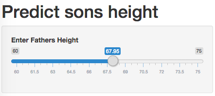

## Theory

Regression toward the mean is a concept wherein measurements taken at extremes will be closer to the mean of the
sample over sucessive measurements.

--- .class #id

## Background

Exploring a data set of about 1100 father and son pairs we can find a correlation between heights of fathers with those of their sons. With that we can build a simple prediction algorithm which follows the principles of regression toward the mean. In effect, we expect tall fathers to have sons who are also tall but not as tall as their fathers and we can expect short fathers to have short sons who are also not as short as their fathers.

---

## APP

In this shiny app the user will select the fathers height on the slider.

Then the expected son's height will be displayed on the plot.

---

## Links

The app is found on [shinyapps](https://ericrybicki.shinyapps.io/Dev_Data_Products/)

and version control on [github](https://github.com/EricRybicki/Dev_Data_Products)

